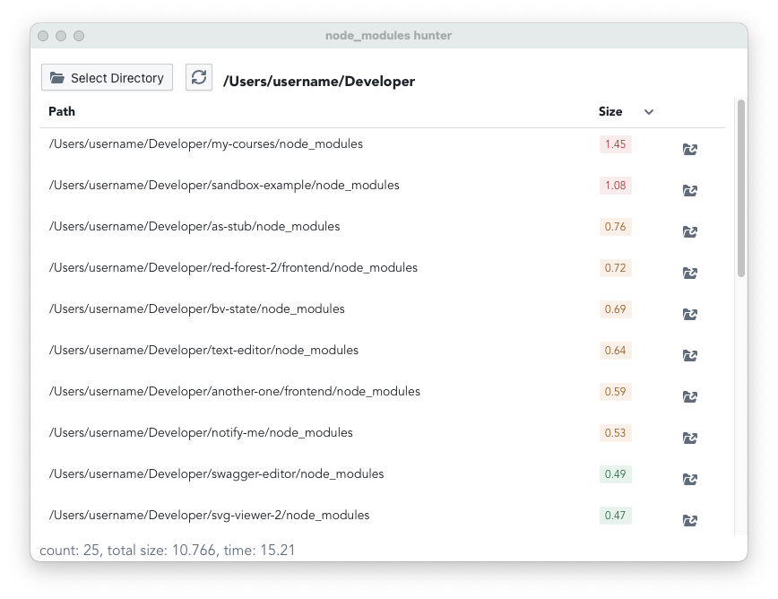

# node_modules hunter

Recursively search for node_modules in a specified directory.

Made with [tauri.app](https://tauri.app/).



Current API usage:

- `Command`: run main logic
- `Event`: on found next node_modules, open in finder
- `Dialog`: select target directory
- `mockIPC`: browser-only development
- `waldir`: recursive search directories
- `std::process::Command`: run `open -R /path/to/dir` (reveals in finder) and `du -sk /path/to/dir` (get dir size)

Frontend stack:

- react
- [effector](https://effector.dev/)
- [blueprintjs](https://blueprintjs.com/docs/)

## Usage

```bash
# install
git clone
pnpm i

# development
pnpm run dev # browser only
pnpm tauri run dev

# build
pnpm tauri run build
```
